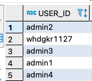
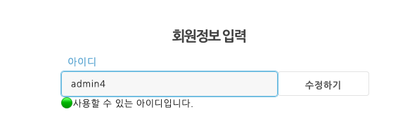
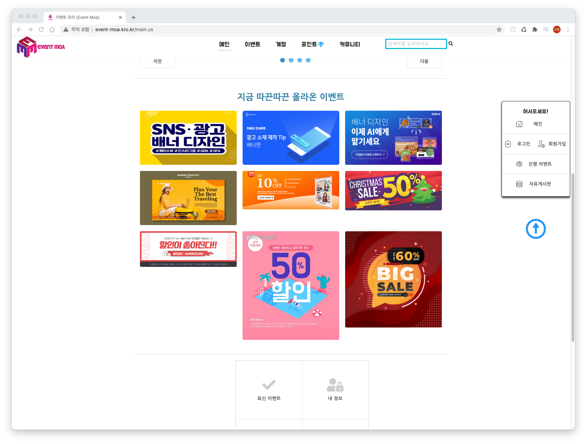
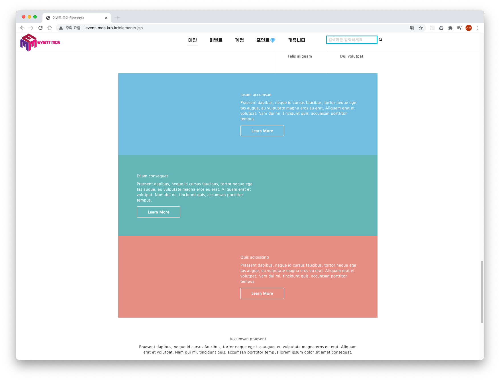

이미 있는 계정임에도 불구하고 중복확인 요청을 하면
사용이 가능하다 해버린다..

아이디 안적어도 중복확인 진행  --> 수정 

이메일을 안적어도 중복확인 진행 --> 수정

- 메인화면 따끈따끈 올라온 이벤트 레이아웃 문제 (모바일에서도)

  

  

- 자유게시판 댓글 추가시 (댓글 날짜 추가) 

- 댓글 등록, 삭제시 alert 삭제

-----작업해야할거

이벤트 상세보기 댓글 및 평점 구현

이벤트 등록시 포인트 구현

포인트 결제내역 뿌리기

회원가입 시 포인트 300포인트 지급 

회원탈퇴 구현 

이벤트관리 - 내가 등록한 이벤트들만 보여주고 삭제, 수정 

